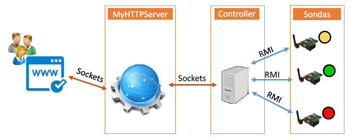
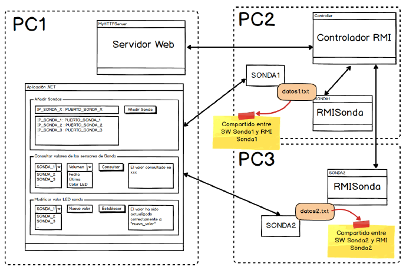

# SD
Repositorio para las prácticas de Sistemas Distribuidos

## Curso 2016/2017

La práctica 1 consiste en, utilizando Java como lenguaje, realizar el siguiente escenario integrando las distintas tecnologías de Sockets, RMI y Servicios Web:

La práctica 2 consiste en realizar una aplicación .NET que se comunique con lo que ya se ha realizado en la práctica 1, aplicando conceptos de seguridad y auditoría dando como resultado el siguiente escenario:

## Autores

* **Lawrence Rider García** - *Programador* - [Larry](http://www.larryrider.es)

Puedes ver también la lista de los [contribuidores](https://github.com/larryrider/SD/contributors) que han participado en este proyecto.

## Licencia

Este proyecto está bajo la licencia GNU GPL - revisa [LICENSE](LICENSE) para ver más detalles.
